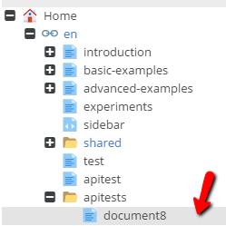
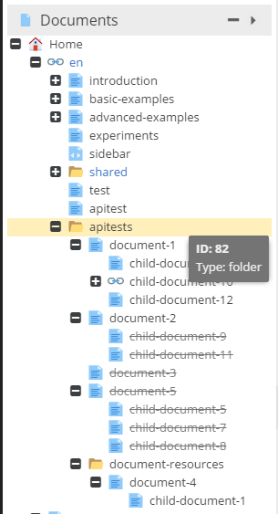

# Working with Documents via PHP API

Pimcore provides the object orientated PHP API to work with Documents.

## CRUD Operations

### Create a New Document
To create a new document you need to specify two mandatory attributes:
* An unique key
* A parent ID - ID of the parent document (document, folder and every other type)
 
You can set also every other value available in documents structure (settings, properties, children etc.).

> Type of the document (page, folder, link, email, snippet etc.) The complete list with available core types you can find here: `\Pimcore\Model\Document::$types`
> Every type has it's own model, for example: a link document could be created by `new \Pimcore\Model\Document\Link`.

The example below, shows how to create simple page document via the PHP API. 

```php
//CREATE A PAGE DOCUMENT
$page = new \Pimcore\Model\Document\Page();
$page->setKey('document8');
$page->setParentId(82); // id of a document or folder
$page->save();
```

Now you can refresh the parent node of the newly created document in the admin interface (ID `82` in this case) and you'll 
see the newly created document. 



### Edit an Existing Document

If you'd like to get a document you can use the `getById()` or `getByPath()` method from the `\Pimcore\Model\Document` class.

Find below, the list of available methods for loading documents.

| Reference                          | Arguments    | 
|------------------------------------|--------------|
| \Pimcore\Model\Document::getById   | int $id      |
| \Pimcore\Model\Document::getByPath | string $path |

The following code presents how to get the wysiwyg editable value of the document.

```php
//LOAD A DOCUMENT
$document = \Pimcore\Model\Document::getById(4);
if($document) {
    //the logic when the type of the document is page
    /** @var \Pimcore\Model\Document\Page $document */

    /** @var \Pimcore\Model\Document\Tag\Wysiwyg $wysiwygElement */
    $wysiwygElement = $document->getElement('content');
    var_dump($wysiwygElement->getData());

}
```

You've probably guessed that if you want to change value of a chosen editable or any other value, you can just set the value (by an available method) and after, save the document.

```php
//...
/** @var \Pimcore\Model\Document\Tag\Wysiwyg $wysiwygElement */
$wysiwygElement = $document->getElement('content');
$wysiwygElement->setDataFromResource('<p>Lorem Ipsum is simply dummy text of the printing and typesetting.</p>');
$document->save(); //save changes in the document
```

### Delete a Document

As simple or even simpler is deletion. 
Just load the document and use `delete` method available in `\Pimcore\Model\Document`.

```php
$document = \Pimcore\Model\Document::getById(110);
if ($document) {
    $document->delete();
}
```

<a name="documentsListing">&nbsp;</a>

## Document Listings

### Examples

Let's assume that we have the following document tree structure: 



The code below retrieves all published documents with parentId = 82: 

```php
$listing = new \Pimcore\Model\Document\Listing(); 
$listing->setCondition("parentId = 82");
foreach($listing as $doc) {
    // do whatever you like
}
```

If you'd like to get also all the unpublished documents, set the following flag: `$listing->setUnpublished(true);`. 

### Configurations

| Method           | Arguments           | Description                                                                       |
|------------------|---------------------|-----------------------------------------------------------------------------------|
| `setOrder()`     | string (asc,desc)   | Set ascending or descending order type.                                           |
| `setOrderKey()`  | string              | Chosen column name / names for as a order key. You can choose many order keys.    |
| `setLimit()`     | int                 | amount of collection results limit                                                |
| `setOffset()`    | int                 | a distance from beginning of the collection items                                 |
| `setCondition()` | string              | Your own SQL condition like in the example above.                                 |


### Methods

| Method                  | Arguments                           | Description                                                                                 |
|-------------------------|-------------------------------------|---------------------------------------------------------------------------------------------|
| `getTotalCount()`       |                                     | Returns total number of selected rows.                                                      |
| `getPaginatorAdapter()` |                                     | List implements `\Zend_Paginator_Adapter_Interface`, you could use the list as a paginator. |
| `getItems()`            | int $offset, int $itemsCountPerPage | as arguments you have to specify the limit of rows and the offset.                          |
| `loadIdList()`          |                                     | Returns complete array with id as a row.                                                    |

If you want to know more about the paginator usage with lists, you should visit [Working with Objects via PHP API part](../05_Objects/03_Working_with_PHP_API.md#zendPaginatorListing)


### Advanced Example


```php
$listing = new \Pimcore\Model\Document\Listing();
$listing->setUnpublished(1);
$listing->setCondition("`parentId` = 82")
    ->setOrderKey(['key', 'published'])
    ->setOrder('desc')
    ->setOffset(2)
    ->setLimit(2);
    
    
$listing->getTotalCount(); 
$listing->loadIdList(); 

foreach($listing as $item) {
    // ...
}
```

Alternatively, you can use the following static method to get a listing of documents: 

```php
//list all published children from the folder
/** @var \Pimcore\Model\Document\Listing $listing */
$listing = \Pimcore\Model\Document::getList([
    'unpublished' => true,
    'condition' => "`parentId` = 82",
    'orderKey' => ['key', 'published'],
    'order' => 'desc',
    'offset' => 2,
    'limit' => 2
]);
```


